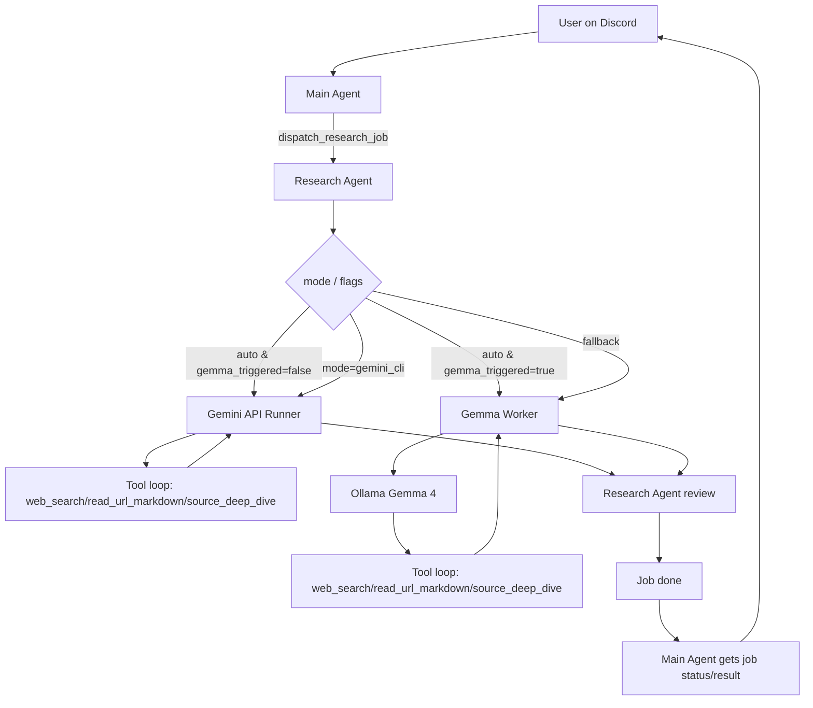

# Current Route Diagram (Main / Research / Gemini API / Gemma Worker)

この資料は、現在実装に準拠した実行経路を整理したものです。

## 1行責務図

- Main Agent: Discord入出力、一次判断、Research Agentへの委譲、最終応答。
- Research Agent: ジョブ受付・状態管理、実行ルート選択、返却可否判定、原文アーティファクト保存。
- Gemini API Runner: Gemini API native で tool loop を回し、調査結果を生成する。
- Gemma Worker: Ollama(Gemma 4) を使って tool loop / 補強分析 / 再ランクを実行する。

## 全体シーケンス（現在実装）

## 分岐の要点

1. `auto` で `gemma_triggered=false` の場合:
- Research Agentは Gemini API Runner へ直行。

2. `auto` で `gemma_triggered=true` の場合:
- Research Agentは Gemma Worker を優先する。

3. `mode=gemini_cli`:
- 互換値として受け付けるが、実際には Gemini API Runner を使う。

4. `fallback`:
- Gemini API Runner を使わず、Gemma Worker を優先する。

5. 最終フォールバック:
- どちらの runner も失敗した場合のみ、Research Agent が失敗として返す。

## 重要な注意（誤解しやすい点）

- Gemini API Runner と Gemma Worker は、どちらも自分自身で tool loop を回す。
- Research Agent はその結果をレビューし、原文アーティファクトを保存する。
- 長時間ループの主体は runner 側であり、Research Agent 自身ではない。

## ログで追うときの最短キー

- Main -> Research 委譲:
  - `[route] main-agent -> research-agent ...`
- Research -> Gemini API:
  - `[route] research-agent -> gemini-api ...`
- Research -> Gemma Worker:
  - `[route] research-agent -> gemma-worker ...`
- Gemma Worker -> Ollama:
  - `[route] gemma-worker -> ollama ...`
- Research job lifecycle:
  - `[route] research-agent job_started ...`
  - `[route] research-agent job_completed ...`
